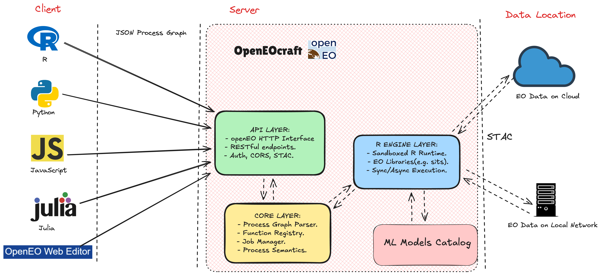

# OpenEOcraft
OpenEOcraft offers a robust R framework designed for the development and deployment of openEO API applications. This package simplifies the process of creating RESTful openEO web services with its user-friendly and flexible interface. Built on Plumber, OpenEOcraft prioritizes ease of use, scalability, and adaptability.



## Quick Start with Docker Hub

The easiest way to get started with OpenEOcraft is by using the pre-built Docker image from Docker Hub:

```bash
docker run -p 8000:8000 brianpondi/openeocraft:latest
```

This will start the OpenEOcraft server and make it available at `http://localhost:8000`.

## Deployment Options

### Local Deployment with R
If you have R installed and the relevant packages like plumber, sits, torch, jsonlite, etc., you can run the server locally. 

1. Clone the repository:
```bash
git clone https://github.com/Open-Earth-Monitor/openeocraft.git
cd openeocraft
```

2. Run the server:
```bash
Rscript docker/server.R
```

### Development with Docker Compose
For development or custom modifications, you can build and run using Docker Compose:

```bash
git clone https://github.com/Open-Earth-Monitor/openeocraft.git
cd openeocraft
docker-compose up
```

#### Common Docker Compose Commands:
- Run in detached mode: `docker-compose up -d`
- Stop the containers: `docker-compose down`
- Force rebuild and restart: `docker-compose up --build --force-recreate --no-deps -d`
- Rebuild with no cache: `docker-compose build --no-cache && docker-compose up`

## Example Workflows

### Authentication
Default credentials for the development server:
- Username: `user`
- Password: `password`

### R Example: TempCNN Model Training

**Note:** Training data is located in `inst/demo-paper-2025/data/` within the repository.

```r
library(openeo)
connection <- connect("http://127.0.0.1:8000")
login(user = "user", password = "password")

# Retrieve available processes from the backend
p <- processes()
# Load Sentinel-2 Data
datacube <- p$load_collection(
    id = "mpc-sentinel-2-l2a",
    spatial_extent = list(
        west = -63.33,
        south = -12.03,
        east = -62.43,
        north = -11.13,
        crs = 4326
    ),
    temporal_extent = c("2022-01-01", "2022-12-31")
)
# Regularize the Sentinel-2 data
datacube <-  p$cube_regularize(data = datacube,
                               period = "P16D",
                               resolution = 600)
# NDVI calculation and merge with the original datacube
datacube_ndvi <- p$ndvi(
    data = datacube,
    red = "B04",
    nir = "B08",
    target_band = "NDVI"
)
datacube <- p$merge_cubes(datacube, datacube_ndvi)
# Load training data from the package installation directory
data_deforestation_rondonia <- readRDS("inst/demo-paper-2025/data/samples_deforestation_rondonia.rds")
# Initialize TempCNN model
tempcnn_model_init <-  p$mlm_class_tempcnn(optimizer = "adam",
                                           learning_rate = 0.0005,
                                           seed = 42)
# Model Training
tempcnn_model <-  p$ml_fit(
    training_set = jsonlite::serializeJSON(data_deforestation_rondonia),
    target = "label"
)
# Apply the trained model to make a prediction
datacube <-  p$ml_predict(datacube, tempcnn_model)
# Save the Model
model <- p$save_ml_model(
    tempcnn_model,
    name = "tempcnn_model_2022_rondonia",
    tasks = list("classification"),
    options = list("accelerator" = "macos-arm", "framework" = "Torch for R")
)
# Save the prediction result
ml_job <- p$save_result(data = datacube, format = "GTiff")

# Run the job
job <- create_job(graph = ml_job,
                  title = "Deforestation Prediction in Rondonia",
                  description =
                      "Using TempCNN model to predict deforestation in Rondonia")
job <- start_job(job)

# Display job information
status <- describe_job(job)
print(paste("Job status:", status$status))

# Download results when complete
if (status$status == "finished") {
    results <- download_results(job, "./output")
    print("Results downloaded to ./output directory")
}
```

### Python Example: Interacting with EO Data Cubes

**Note:** This example requires the custom Python client. Install it locally:
```bash
pip install git+https://github.com/PondiB/openeo-python-client.git
```

```python
import openeo

# Connect to the OpenEO backend
connection = openeo.connect("http://127.0.0.1:8000")
connection.authenticate_basic("user", "password")

# Check available collections and processes
print("Available collections:", connection.list_collection_ids())
print("\nAvailable processes:", [p["id"] for p in connection.list_processes()])

# Define the area of interest (Rondonia, Brazil)
bbox = {
    "west": -63.33, "south": -12.03,
    "east": -62.43, "north": -11.13,
    "crs": 4326
}
temporal_extent = ["2022-01-01", "2022-12-31"]

# Load and preprocess the satellite data
datacube = connection.load_collection(
    "mpc-sentinel-2-l2a",
    spatial_extent=bbox,
    temporal_extent=temporal_extent,
    bands=["B02", "B03", "B04", "B08", "SCL"]
)

datacube = datacube.process(
    process_id="cube_regularize",
    arguments={
        "data": datacube,
        "period": "P1M",  #16 days or 1 month  regularization 
        "resolution": 300
    }
)

datacube_ndvi = datacube.ndvi(red = "B04", nir = "B08", 
                                    target_band = "NDVI")
datacube = datacube.merge_cubes(datacube_ndvi)

# Load training data from the package installation directory
serialized_data = connection.readRDS("inst/demo-paper-2025/data/samples_deforestation_rondonia_1M.rds")


# Initialize and Train the Model
tempcnn_model_init = connection.mlm_class_tempcnn(
    optimizer="adam",
    learning_rate=0.0005,
    seed=42
)

tempcnn_model = tempcnn_model_init.fit(
    training_set=serialized_data,
    target="label"
)

# Make Predictions
datacube =  tempcnn_model.predict(datacube)

# Save the trained model for future use.
tempcnn_model.save_ml_model(name ="tempcnn_rondonia", tasks=["classification"], options={"accelerator":"macos-arm", "framework":"Torch for R"})

# Save and Execute Results
result = datacube.save_result(
    format="GeoTiff"
)

job = result.create_job(
    title="Deforestation Prediction in Rondonia",
    description="Using TempCNN model to predict deforestation in Rondonia"
)

job.start_and_wait()
results = job.get_results()
results.download_files("data/output")
```


