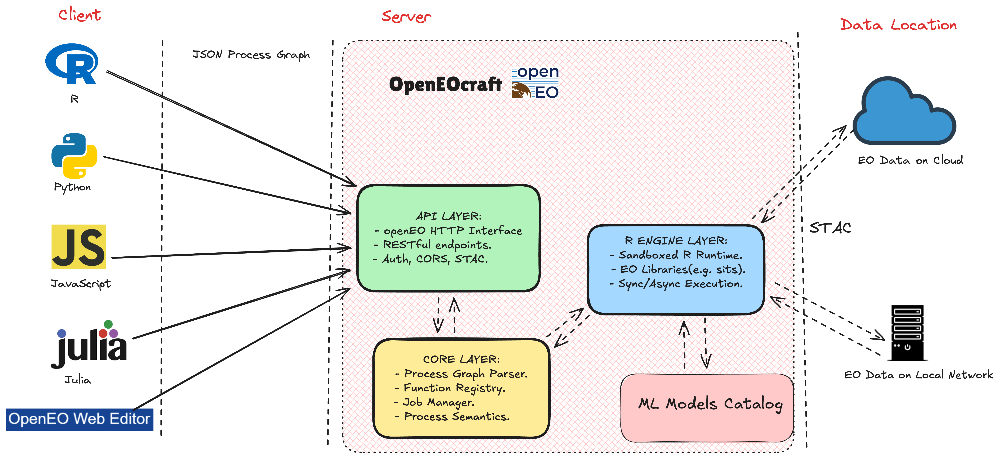

# OpenEOcraft
OpenEOcraft offers a robust R framework designed for the development and deployment of openEO API applications. This package simplifies the process of creating RESTful openEO web services with its user-friendly and flexible interface. Built on Plumber, OpenEOcraft prioritizes ease of use, scalability, and adaptability.



## Quick Start with Docker Hub

The easiest way to get started with OpenEOcraft is by using the pre-built Docker image from Docker Hub:

```bash
docker run -p 8000:8000 brianpondi/openeocraft:latest
```

This will start the OpenEOcraft server and make it available at `http://localhost:8000`.

## Deployment Options

### Local Deployment with R
If you have R installed and the relevant packages like plumber, sits, torch, jsonlite, etc., you can run the server locally. 

1. Clone the repository:
```bash
git clone https://github.com/Open-Earth-Monitor/openeocraft.git
cd openeocraft
```

2. Run the server:
```bash
Rscript docker/server.R
```

### Development with Docker Compose
For development or custom modifications, you can build and run using Docker Compose:

```bash
git clone https://github.com/Open-Earth-Monitor/openeocraft.git
cd openeocraft
docker-compose up
```

#### Common Docker Compose Commands:
- Run in detached mode: `docker-compose up -d`
- Stop the containers: `docker-compose down`
- Force rebuild and restart: `docker-compose up --build --force-recreate --no-deps -d`
- Rebuild with no cache: `docker-compose build --no-cache && docker-compose up`

## Resource guidelines (Docker and production)

OpenEOcraft does **not** probe the physical host directly. It uses **whatever CPUs and memory the R process sees** (inside the container, that is usually the **cgroup** limit from Docker or Kubernetes).

### Default behaviour (ML / sits tuning paths)

Defined in `inst/ml/processes.R` (see comments at the top of that file):

| Mechanism                                                                   | Default                                                                                                                                                                                                                                                   |
| --------------------------------------------------------------------------- | --------------------------------------------------------------------------------------------------------------------------------------------------------------------------------------------------------------------------------------------------------- |
| **CPU parallel jobs** (`multicores` passed to sits, e.g. k-fold validation) | `parallel::detectCores(logical = FALSE)` × **`openeocraft.resource_fraction`** (default **0.75**), capped by **`openeocraft.multicores_max`** (default **16**).                                                                                           |
| **Sits `memsize` (GB)**                                                     | If **`openeocraft.memsize`** is unset and **`openeocraft.memsize_auto`** is `TRUE`: total RAM from **`Sys.meminfo()`** (R ≥ 4.4) or **`/proc/meminfo`** on Linux × **`resource_fraction`**, capped at 256 GB. If detection fails, falls back to **8** GB. |

So the backend aims for **~75% of the resources visible inside the container**, not 75% of a bare-metal host unless the container sees the full host.

### Docker: give the container the capacity you want

- **CPU:** e.g. `docker run --cpus="8" ...` or Compose `cpus:` / Kubernetes `resources.limits.cpu`.
- **Memory:** e.g. `docker run -m 32g ...` or Compose `mem_limit:` / K8s `resources.limits.memory`.

Without limits, behaviour depends on the host and cgroup version; **setting limits** makes OpenEOcraft’s auto settings align with your intended share of the machine.

Example:

```bash
docker run -p 8000:8000 --cpus="16" -m 64g brianpondi/openeocraft:latest
```

### R `options()` overrides

Set these **before** jobs run (e.g. at the top of `docker/server.R`, or via `.Rprofile` in the image):

```r
# Use 90% of detected resources instead of 75%
options(openeocraft.resource_fraction = 0.9)

# Allow more than 16 parallel cores (or Inf to disable the cap)
options(openeocraft.multicores_max = 32)

# Fixed sits memory budget in GB (skips auto-detection)
options(openeocraft.memsize = 48L)

# Turn off RAM auto-detection and use the 8 GB fallback
options(openeocraft.memsize_auto = FALSE)
```

### BLAS / Torch threading

Sits `multicores` is not the only source of parallelism. **OpenMP / MKL / torch** may spawn extra threads. For predictable use inside a container, set environment variables **before R starts** (Docker `ENV`, Compose `environment:`, systemd, etc.), for example:

- `OMP_NUM_THREADS`
- `MKL_NUM_THREADS`
- `TORCH_NUM_THREADS`

Align these with the CPU quota you gave the container.

### GPU (CUDA)

For NVIDIA GPUs, run the container with GPU access (e.g. `docker run --gpus all ...`). That is independent of the `multicores` / `memsize` logic; torch/sits can still use the GPU when available.

## Example Workflows

### Authentication

- **Docker Hub quick start** (above): often `user` / `password`.
- **Local / dev** (see `docker/plumber.R` and notebooks under `inst/demo-lps-2025/`): often `brian` / `123456`.

### Python example (first): P16D cube, NDVI, TempCNN — `00_ml_month.ipynb`

Same pipeline as [`inst/demo-lps-2025/00_ml_month.ipynb`](inst/demo-lps-2025/00_ml_month.ipynb) and [`inst/demo-paper-2025/tempcnn_model_training.R`](inst/demo-paper-2025/tempcnn_model_training.R), as **one runnable script**. The worker downloads training samples from **HTTPS** (no local `readRDS`).

Requires a Python client with ML helpers, e.g.:

```bash
pip install git+https://github.com/PondiB/openeo-python-client.git
```

**Timeline / bands:** [`samples_deforestation_rondonia.rds`](https://github.com/Open-Earth-Monitor/openeocraft/raw/main/inst/demo-paper-2025/data/samples_deforestation_rondonia.rds) was built for a **P16D** cube (not P1M) and the same preprocessing as that R script (**600 m** resolution, selected bands + NDVI). If `cube_regularize` uses a different **`period`** or **`resolution`**, sits raises **`.check_samples_tile_match_timeline: tile timeline does not match samples timeline`**. Use **`B04` / `B08`** in `ndvi` after regularize. For a smaller 10-band cube without NDVI, see the second Python block and [`01_ml_api_eo_data_cubes.ipynb`](inst/demo-lps-2025/01_ml_api_eo_data_cubes.ipynb).

```python
#!/usr/bin/env python3
"""OpenEOcraft: P16D + NDVI + TempCNN (Rondonia). See 00_ml_month.ipynb."""

import openeo

BACKEND_URL = "http://127.0.0.1:8000"
USER = "user"
PASSWORD = "password"

TRAINING_RDS_URL = (
    "https://github.com/Open-Earth-Monitor/openeocraft/raw/main/"
    "inst/demo-paper-2025/data/samples_deforestation_rondonia.rds"
)

connection = openeo.connect(BACKEND_URL)
connection.authenticate_basic(USER, PASSWORD)

print("Available collections:", connection.list_collection_ids())
print("Available processes:", [p["id"] for p in connection.list_processes()])

bbox = {
    "west": -63.33,
    "south": -12.03,
    "east": -62.43,
    "north": -11.13,
    "crs": 4326,
}
temporal_extent = ["2022-01-01", "2022-12-31"]

datacube = connection.load_collection(
    "aws-sentinel-2-l2a",
    spatial_extent=bbox,
    temporal_extent=temporal_extent
)

datacube = datacube.process(
    process_id="cube_regularize",
    arguments={
        "data": datacube,
        "period": "P16D",
        "resolution": 600,
    },
)

datacube = datacube.ndvi(red="B04", nir="B08", target_band="NDVI")

tempcnn_model_init = connection.mlm_class_tempcnn(
    optimizer="adam",
    learning_rate=0.0005,
    seed=42,
)
tempcnn_model = tempcnn_model_init.fit(
    training_set=TRAINING_RDS_URL,
    target="label",
)

datacube = tempcnn_model.predict(datacube)
tempcnn_model.save_ml_model(name="tempcnn_rondonia")

result = datacube.save_result(format="GeoTiff")
job = result.create_job(
    title="Deforestation Prediction in Rondonia",
    description="Using TempCNN model to predict deforestation in Rondonia",
)
job.start_and_wait()
job.get_results().download_files("data/output")
```

### R example: TempCNN on Rondonia (aligned with `inst/demo-lps-2025/`)

Use **`ml_fit(model = …, training_set = …)`** — the first argument must be the model spec from `mlm_class_*`. For [`samples_deforestation_rondonia.rds`](https://github.com/e-sensing/sitsdata/raw/main/data/samples_deforestation_rondonia.rds), the prediction cube must use the **same spectral bands** as the samples (10 S2 bands; **no** extra NDVI/`cloud` layer unless the RDS was built with them).

```r
library(openeo)

con <- connect(
    host = "http://127.0.0.1:8000",
    user = "brian",
    password = "123456"
)
p <- processes()

# Public sits samples (HTTPS URL); alternatively use jsonlite::serializeJSON(your_sits_tibble)
rondonia_url <-
    "https://github.com/e-sensing/sitsdata/raw/main/data/samples_deforestation_rondonia.rds"

# Cube bands must match the training RDS (lowercase names are fine; backend maps them)
dc <- p$load_collection(
    id = "mpc-sentinel-2-l2a",
    spatial_extent = list(
        west = -63.50,
        south = -8.92,
        east = -63.35,
        north = -8.78
    ),
    temporal_extent = c("2022-01-01", "2022-12-31"),
    bands = list(
        "b02", "b03", "b04", "b05", "b06", "b07", "b08",
        "b11", "b12", "b8a"
    )
)

dc <- p$cube_regularize(data = dc, period = "P16D", resolution = 300)

spec <- p$mlm_class_tempcnn(
    optimizer = "adam",
    learning_rate = 0.0005,
    seed = 42,
    epochs = 20,
    batch_size = 64,
    verbose = TRUE
)

fitted <- p$ml_fit(
    model = spec,
    training_set = rondonia_url,
    target = "label"
)

dc <- p$ml_predict(data = dc, model = fitted)

# Optional: persist model metadata in the job workspace
# p$save_ml_model(data = fitted, name = "tempcnn_rondonia_2022")

job_graph <- p$save_result(data = dc, format = "GTiff")

job <- create_job(
    graph = job_graph,
    title = "Rondonia TempCNN",
    description = "Train on sits sample URL; predict GeoTIFF"
)
job <- start_job(job)

status <- describe_job(job)
if (status$status == "finished") {
    download_results(job, "./output")
}
```

More patterns (export cube, RF-only training, etc.): `inst/examples/`. Training **without** the HTTP API: `inst/examples/04_ml_tempcnn.R` (uses `jsonlite::serializeJSON` on an in-memory sits object and `export_ml_model`).

### Python: Rondonia TempCNN — `mpc`, P16D, 10 bands (no NDVI)

Shorter alternative when you want **`mpc-sentinel-2-l2a`**, a **small bbox**, and **`samples_deforestation_rondonia.rds`** (10 bands, no NDVI). Same idea as [`01_ml_api_eo_data_cubes.ipynb`](inst/demo-lps-2025/01_ml_api_eo_data_cubes.ipynb).

```python
import openeo

connection = openeo.connect("http://127.0.0.1:8000")
connection.authenticate_basic("brian", "123456")

rondonia_url = (
    "https://github.com/e-sensing/sitsdata/raw/main/data/samples_deforestation_rondonia.rds"
)

datacube = connection.load_collection(
    collection_id="mpc-sentinel-2-l2a",
    spatial_extent={
        "west": -63.50,
        "south": -8.92,
        "east": -63.35,
        "north": -8.78,
    },
    temporal_extent=["2022-01-01", "2022-12-31"],
    bands=[
        "b02", "b03", "b04", "b05", "b06", "b07", "b08",
        "b11", "b12", "b8a",
    ],
)

datacube = datacube.process(
    process_id="cube_regularize",
    arguments={
        "data": datacube,
        "period": "P16D",
        "resolution": 300,
    },
)

tempcnn_model_init = connection.mlm_class_tempcnn(
    optimizer="adam",
    learning_rate=5e-4,
    seed=42,
    epochs=20,
    batch_size=64,
    verbose=True,
)

tempcnn_model = tempcnn_model_init.fit(
    training_set=rondonia_url,
    target="label",
)

datacube = tempcnn_model.predict(datacube)

result = datacube.save_result(format="GeoTiff")

job = result.create_job(
    title="Rondonia TempCNN",
    description="Train on sits sample URL; predict GeoTiff",
)
job.start_and_wait()
job.get_results().download_files("output")
```

**Other workflows:** Random forest + Breizh-style alignment (constants shared with R) live in `inst/examples/breizh_openeo_training_predict_aligned.py`. Step-by-step notebooks: `inst/demo-lps-2025/`.


