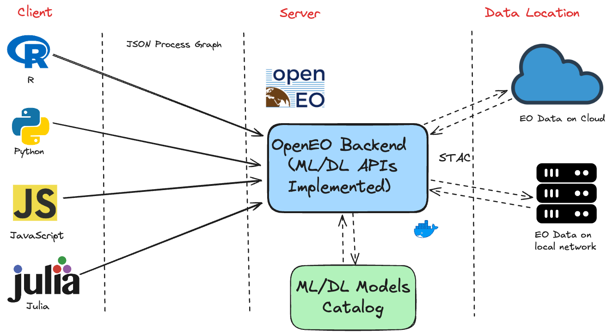

```{r setup, include=FALSE}
knitr::opts_chunk$set(echo = TRUE, warning = FALSE, message = FALSE)
```

# ML API Specification

This work presents the design and specification of the ML API processes for the openEO ecosystem, structured to address four pillars: initialization of model architectures, execution of training/prediction tasks, and management of model artifacts. By decoupling ML logic from backend implementations, the API enables portable workflows that are reusable across infrastructures.



## Design Principles

The core principles that guided the API development include:

- **Modularity**
- **Consistency**
- **Backend-Agnosticism**
- **Default Parameters**
- **Extensible**

## Model Initialization

The model initialization phase, facilitated by processes prefixed with `mlm_`, is designed to create untrained model definition objects. Each process name follows the pattern:

```
mlm_<type>_<model>
```

where `<type>` is an abbreviated ML action category (e.g., `class` for classification, `regr` for regression, `segm` for segmentation, `gen` for generative, etc.) and `<model>` specifies the particular algorithm (e.g., `random_forest`, `svm`, `xgboost`, `tempcnn`, `tae`, etc.).

| Process Name              | Description                                                               |
| ------------------------- | ------------------------------------------------------------------------- |
| `mlm_class_catboost`      | Initializes a CatBoost classification model                               |
| `mlm_class_mlp`           | Initializes a Multi-Layer Perceptron (MLP) classification model           |
| `mlm_class_random_forest` | Initializes a Random Forest classification model                          |
| `mlm_class_svm`           | Initializes a Support Vector Machine (SVM) classification model           |
| `mlm_class_xgboost`       | Initializes an XGBoost classification model                               |
| `mlm_class_tempcnn`       | Initializes a Temporal Convolutional Neural Network (TempCNN) model       |
| `mlm_class_tae`           | Initializes a Temporal Attention Encoder (TAE) model                      |
| `mlm_class_lighttae`      | Initializes a lightweight version of the Temporal Attention Encoder model |
| `mlm_regr_svm`            | Initializes a Support Vector Machine regression model                     |
| `mlm_regr_random_forest`  | Initializes a Random Forest regression model                              |

## Model Actions

Prefixed with `ml_`, model action processes are responsible for executing key ML workflows on model artifacts and EO data cubes. These actions include model training, prediction, uncertainty estimation, and post-processing.

| Process Name               | Description                                                                                |
| -------------------------- | ------------------------------------------------------------------------------------------ |
| `ml_fit`                   | Fits a machine learning model to a data cube of input features and target values           |
| `ml_predict`               | Applies a trained machine learning model to a data cube of input features                  |
| `ml_predict_probabilities` | Applies a model to input features and returns predicted class probabilities                |
| `ml_uncertainty_class`     | Estimates classification uncertainty using methods like margin, ratio, or least-confidence |
| `ml_smooth_class`          | Applies spatial smoothing to classification probability results using Bayesian inference   |
| `ml_label_class`           | Converts a probability data cube to a labeled data cube                                    |

## Model Management

Model management processes handle the storage and retrieval of ML artifacts. They enable users to export and import preliminary or private models into their workspace and to export and import models using STAC ML Model extension compliance.

| Process Name      | Description                                                                              |
| ----------------- | ---------------------------------------------------------------------------------------- |
| `import_ml_model` | Imports a previously exported machine learning model from a specified workspace location |
| `export_ml_model` | Exports a machine learning model to a specified workspace location                       |
| `load_ml_model`   | Loads a machine learning model from a STAC:MLM Item into the current session             |
| `save_ml_model`   | Saves a machine learning model with STAC MLM Extension compliance                        |

# Temporal CNN Example

This section demonstrates how to train a Temporal CNN (TempCNN) model using OpenEO processes. The example uses deforestation data from Rondonia to train a deep learning model for time series classification.

## Setup and Connection

First, we load the required libraries and connect to the OpenEO backend:

```{r}
library(openeo)

# Connect to the backend
con <- connect(
  host = "http://127.0.0.1:8000",
  user = "brian",
  password = "123456"
)

# Access processes
p <- processes()
p

```
## Describe processes
```{r}
openeo::describe_process("mlm_class_tempcnn")
```


```{r}
openeo::describe_process("mlm_class_random_forest")
```

## Load Training Data

We load the pre-processed training data for deforestation in Rondonia:

```{r}
# Load sits tibble Training data
data_deforestation_rondonia <- readRDS("./monthly_rondonia_data.rds")
```

## Define the Temporal CNN Model

Here we define the architecture and hyperparameters for our TempCNN model:

```{r}
# Define the Temporal CNN model
tempcnn_model_init <- p$mlm_class_tempcnn(
  optimizer = "adam",
  learning_rate = 0.0005,
  seed = 42
)
```

## Model Training

Now we fit the model using our training dataset:

```{r}
# Fit the model using the training dataset
tempcnn_model <- p$ml_fit(
  model = tempcnn_model_init,
  training_set = jsonlite::serializeJSON(data_deforestation_rondonia),
  target = "label"
)
```

## Load Sentinel-2 Data

```{r}
datacube = p$load_collection(
  id = "mpc/sentinel-2-l2a",
  spatial_extent = list(
    west = -63.9,
    east = 	-62.9,
    south = -9.14,
    north = -8.14
  ),
  bands = list(
    "B02",
    "B03",
    "B04",
    "B05",
    "B06",
    "B07",
    "B08",
    "B11",
    "B12",
    "B8A"
  ),
  temporal_extent = c("2022-01-01", "2022-12-31"
  )
)
```

# Regularize the data

```{r}
datacube = p$cube_regularize(data = datacube,
                             period = "P1M",
                             resolution = "320")

```

# Apply the trained model to make predictions


```{r}
data <- p$ml_predict(
  data = datacube,
  model = tempcnn_model
)
```

## # Save the prediction results

```{r}

ml_job <- p$save_result(
  data = data,
  format = "GTiff"
)
```
# Run the job
```{r}
job <- create_job(
  graph = ml_job,
  title = "Temp CNN Model - Rondonia - R Client",
  description = "Training a Temp CNN model, Predict with it"
)
job <- start_job(job)

# Display job information
describe_job(job)
```

## Conclusion

This example demonstrated how to:
1. Connect to an OpenEO backend
2. Load and prepare training data
3. Define a Temporal CNN model architecture
4. Train the model
5. Make predictions on new data
6. Save the results


